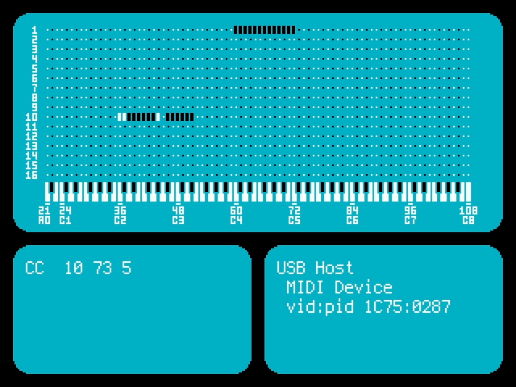

<!-- SPDX-License-Identifier: MIT -->
<!-- SPDX-FileCopyrightText: Copyright 2025 Sam Blenny -->
# Fruit Jam USB MIDI Tester

USB host MIDI tester for Fruit Jam with picodvi MIDI event visualizer.

For more details about this project, check out my
[Fruit Jam USB Host MIDI Tester](https://adafruit-playground.com/u/SamBlenny/pages/fruit-jam-usb-host-midi-tester) Playground guide.

This code was developed and tested on CircuitPython 10.0.0-beta.0 with a
pre-release revision B Fruit Jam prototype. Keep in mind that things may change
by the time CircuitPython 10.0.0 is released.
